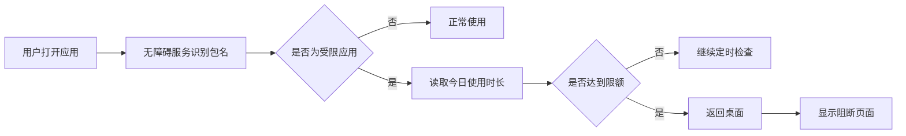

# FocusGuard

FocusGuard 是一款使用 Java 开发的 Android 应用时间管理工具。用户可以同时为多个应用设置每日使用限额；当受限应用达到限额后，FocusGuard 会通过无障碍服务将其退出并显示阻断页面。

> 项目正在持续开发中，目前已经完成应用读取、使用时长统计、多应用限制和超时强制退出的核心流程。

## 项目背景

部分同类应用的免费版本只能限制少量 App，增加限制数量需要付费。FocusGuard 希望提供一个免费、透明的多应用时间管理方案，同时作为一个完整的 Android 学习项目，练习系统权限、应用状态监听、数据持久化和 Git 协作流程。

## 已实现功能

- 读取手机中可从桌面启动的非系统应用
- 展示应用图标、名称和包名
- 同时选择多个需要限制的应用
- 为每个应用设置独立的每日使用限额
- 通过 `UsageStatsManager` 统计应用今日前台使用时长
- 保存已选应用和限制时间，重新打开后自动恢复
- 已选应用置顶，并按今日使用时长从高到低排序
- 引导用户开启使用情况访问权限和无障碍服务
- 通过 `AccessibilityService` 监听当前前台应用
- 应用达到限额后自动返回桌面并展示阻断页面

## 工作流程



## 技术栈

- 开发语言：Java 11
- UI：Android XML Layout
- 最低系统版本：Android 8.0（API 26）
- 编译 SDK：Android API 36
- 列表组件：RecyclerView
- 本地数据：SharedPreferences
- 使用时长统计：UsageStatsManager、UsageEvents
- 前台应用监听与阻断：AccessibilityService
- 版本管理：Git + GitHub

## 核心代码

```text
app/src/main/
├── java/com/luoyilin/focusguard/
│   ├── MainActivity.java
│   ├── AppManageActivity.java
│   ├── AppListAdapter.java
│   ├── AppInfo.java
│   ├── PermissionGuideActivity.java
│   ├── FocusAccessibilityService.java
│   └── BlockedActivity.java
├── res/layout/
│   ├── activity_main.xml
│   ├── activity_app_manage.xml
│   ├── activity_permission_guide.xml
│   ├── activity_blocked.xml
│   └── item_app.xml
└── AndroidManifest.xml
```

## 权限说明

FocusGuard 的核心功能需要用户主动开启以下系统权限：

1. **使用情况访问权限**
   用于读取各应用的前台使用时长，判断是否达到每日限额。

2. **无障碍服务**
   用于识别当前打开的应用，并在受限应用超时后执行返回桌面操作。当前服务配置不读取页面文字或输入内容。

Android 普通应用无法真正“强制停止”其他应用。FocusGuard 采用返回桌面并持续拦截再次打开的方式实现限制效果。用户仍然可以在系统设置中关闭无障碍服务。

## 运行项目

1. 使用 Android Studio 打开项目。
2. 等待 Gradle Sync 完成。
3. 连接 Android 8.0 或更高版本的真机。
4. 运行 `app` 模块。
5. 在 FocusGuard 权限页面开启使用情况访问权限和无障碍服务。
6. 选择需要限制的应用并设置每日限额。

## 后续计划

- [ ] 统一展示两项核心权限的实时状态
- [ ] 优化使用时长统计的准确性和性能
- [ ] 支持用户自定义任意分钟数
- [ ] 增加临时解锁和冷静期机制
- [ ] 增加每日、每周使用趋势统计
- [ ] 增加专注模式和限制时间段
- [ ] 补充单元测试与界面测试
- [ ] 完善应用图标、界面和使用文档

## 项目收获

通过 FocusGuard，我正在实践 Android 原生界面开发、RecyclerView、系统应用信息读取、特殊权限检测、UsageStats 数据处理、AccessibilityService、SharedPreferences 数据持久化以及 GitHub 项目维护。

